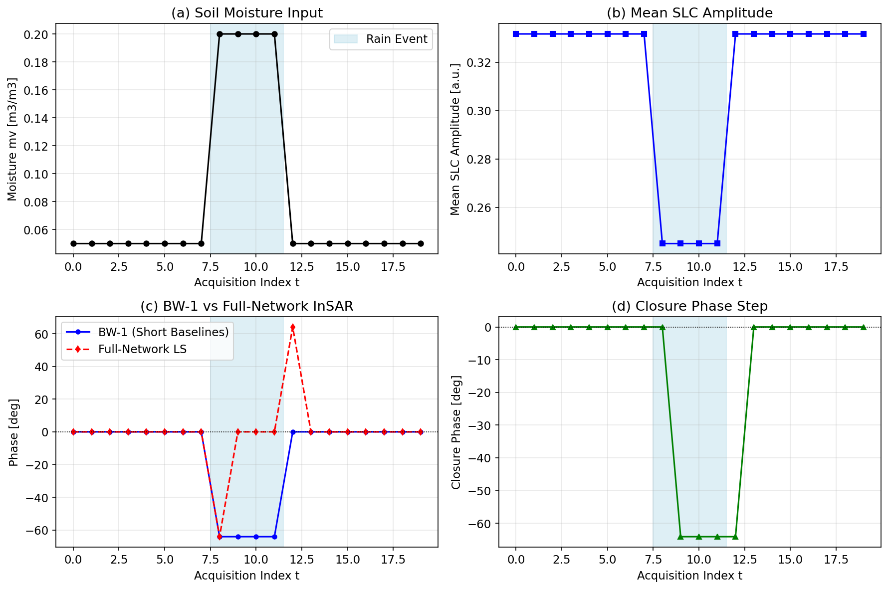
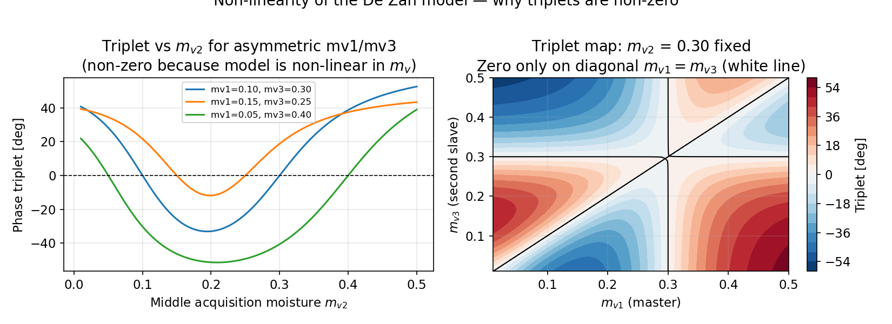

Today I am releasing **NavaSAR 0.1.0a1**, the first public alpha of a Python library for physics-based radar remote-sensing experiments.

The project grew from a practical need: many useful microwave and interferometric models are scattered across papers, books, and one-off research scripts. NavaSAR brings a focused selection of those models into a documented, testable package that can support teaching, reproducible experiments, and early-stage method development.

## What is included in the alpha?

The initial release connects several parts of the radar modeling chain:

- dielectric models for water, soil, vegetation, snow, ice, and material mixtures;
- complex SAR single-look-complex simulation and multilooking;
- interferometric coherence, phase triplets, and closure-phase time series;
- polarimetric scattering, covariance, fading, and speckle tools;
- land-backscatter and detected-image simulations; and
- experimental soil-moisture inversion and retrieval workflows.

The emphasis is on transparent scientific functions rather than a black-box processing system. Inputs, assumptions, and units remain visible so that a result can be inspected and challenged.

## From moisture change to an interferometric signal

The figure below summarizes one simulation workflow. A temporary soil-moisture increase changes the dielectric response and the simulated SLC amplitude. The corresponding interferometric network develops a phase response and a non-zero closure-phase step.

{fig-alt="Four panels showing soil moisture input, mean SLC amplitude, interferometric phase, and closure phase through time."}

Closure phase is particularly interesting because it cancels phase terms that are strictly additive around a closed interferometric loop. A remaining signal can therefore reveal non-linear changes in the scattering medium. In the soil-moisture model used here, the phase triplet depends on the ordering and magnitude of the moisture states.

{fig-alt="Line plot and contour map showing non-zero phase triplets for asymmetric soil-moisture states."}

These plots are simulations, not field validation. The alpha release is intended to make assumptions reproducible and provide a foundation for comparison with observations.

## Reproducibility and scope

NavaSAR is released under the MIT License. The public repository contains source code, documentation, tests, and curated notebooks. Copyrighted reference PDFs and local build artifacts are deliberately excluded.

The package version is marked as an alpha because the API and numerical behavior may still evolve as more validation cases are added. Users should independently verify results before applying them to operational or decision-critical work.

## Try it

```bash
git clone https://github.com/mohseniaref/NavaSAR.git
cd NavaSAR
python -m pip install -e ".[notebooks,test]"
python -m pytest
```

The source code and documentation are available on [GitHub](https://github.com/mohseniaref/NavaSAR). Feedback, reproducible test cases, and carefully scoped contributions are welcome.
